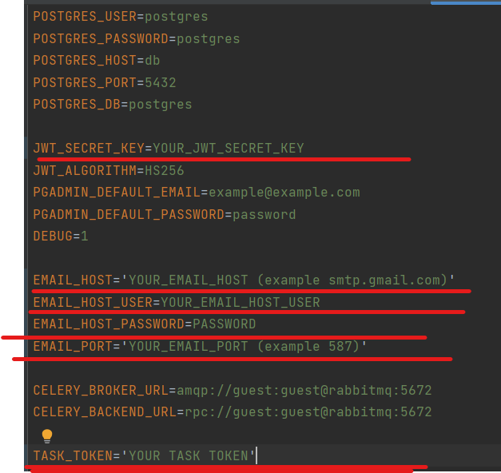
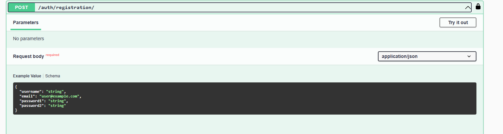
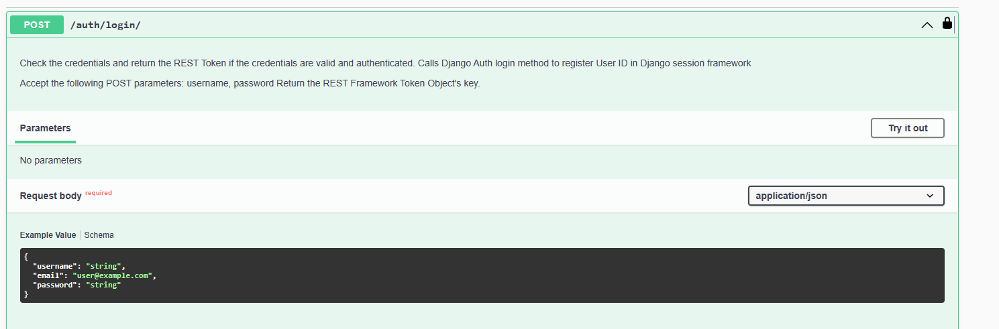
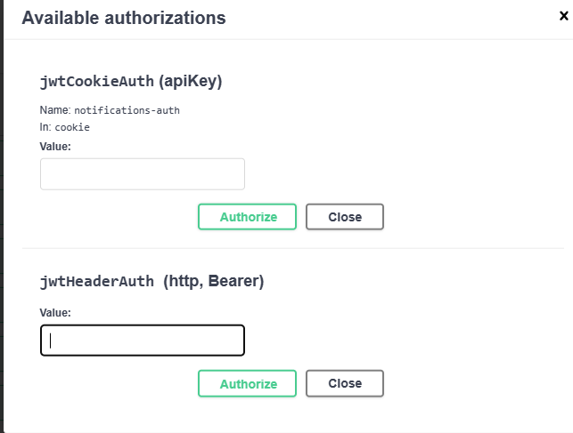
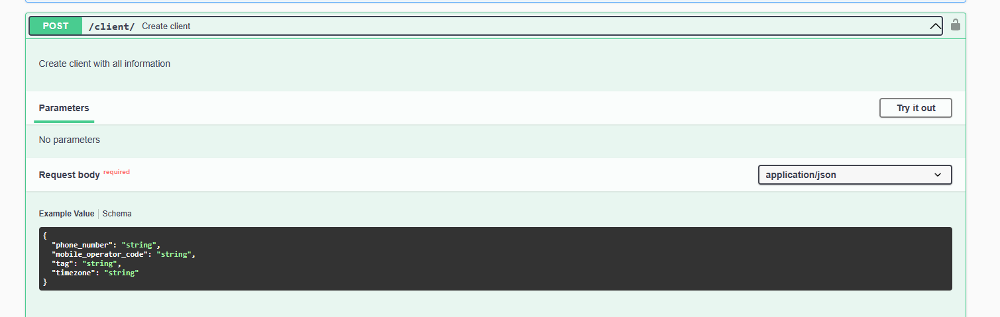
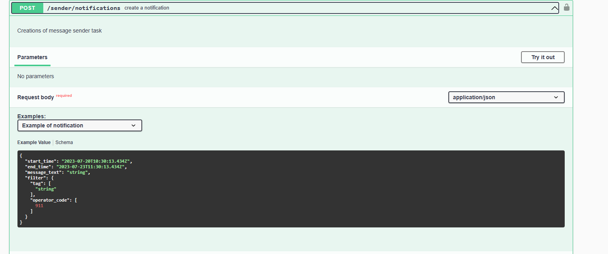
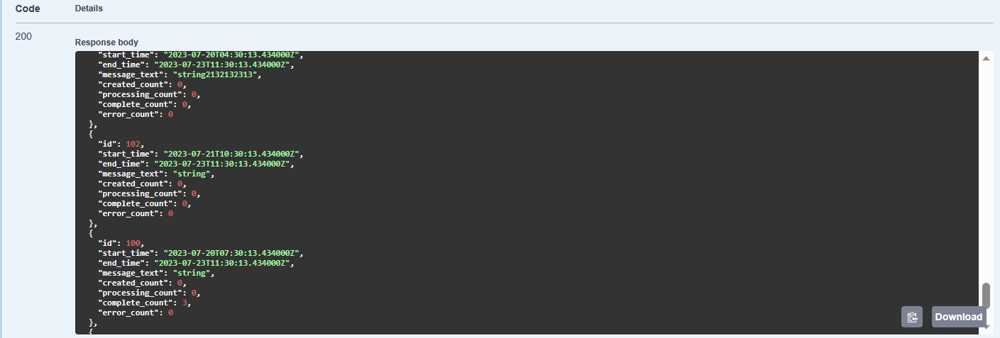
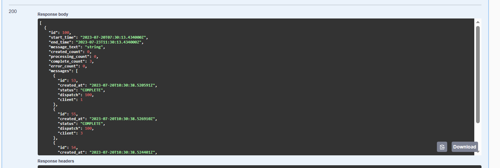
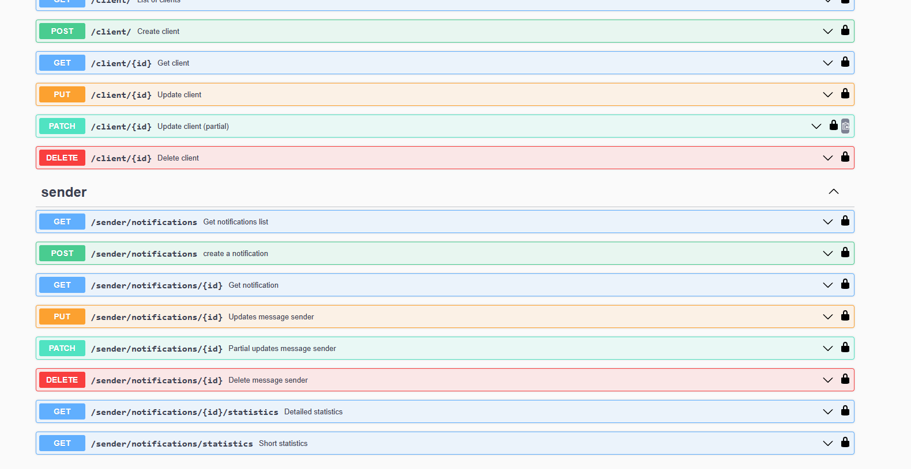

# API для расслылки сообщений клиентам

## Приложение обладает следующим функионалом:
1. добавление нового клиента в справочник со всеми его атрибутами
2. обновление данных атрибутов клиента
3. удаление клиента из справочника
4. добавление новой рассылки со всеми её атрибутами
5. получение общей статистики по созданным рассылкам и количеству отправленных сообщений по ним с группировкой по статусам
6. получение детальной статистики отправленных сообщений по конкретной рассылке
7. обновление атрибутов рассылки
8. удаление рассылки
9. обработка активных рассылок и отправки сообщений клиентам
10. создан файл docker-compose.yml для запуска всего кластера сервисов (пункт доп заданий 3)
11. создана интерактивная документация Swagger по API доступная по адресу `/docs` (пункт доп задания 5)
12. отправка информации по завершенным рассылкам и сообщениям пользователям-администраторам (пункт доп задания 8)

## Стек использованных технологий
1. Django 4.2
2. Celery 
3. Docker
4. Docker compose
5. PostgreSQL
6. smtplib
7. JWT

## Установка 
Требования к установке:
1. docker
2. docker-compose
3. подключение к интернету

Необходимо определить подчеркнутые значение переменных среды 


Для запуска использовать команду 
```shell
docker-compose up --build
```
И дождаться запуска всех сервисов
После запуска можно перейти по адресу http://localhost:8000/docs для доступа к Swagger UI

## Работа с внешним API для сообщений

Для работы необходимо зарегистрироватся используя url `/auth/registration/`

Либо при наличии зарегистрированного пользователя - залогиниться `/auth/login/`



После авторизации полученный `access_token` надо вставить в jwtHeaderAuth

Далее необходимо создать клиента(клиентов), которым и будет происходить рассылка `/client/`


После создания клиентов можно создать расслыку по url `/sender/notifications`
При этом filter - это фильтр для выборки клинетов, которым данная рассылка придет. Tag - это массив строк 
тэгов или `null` если фильтрации по тегам не надо проводить, operator_code - массив целых чисел или `null` если фильтрации по кодам оператора не надо проводить


Для рассылок используется Celery. При создании расслыки она планируется, а когда начинается её выполнение, 
создаются подзадачи для асинхионной отправки каждого сообщения, попутно собиратеся статистика, которую можно 
увидеть по url `sender/notifications/statistics` для списка рассылок с краткой информацией 

Либо `sender/notifications/{id}/statistics` для детальной информации по сообщениям в рассылке


Раз в сутки в 23:59 отправляется информация о завершенных в текущий день расслыках и отправленных в них сообщениях

Эндпоинты сервиса дополнительно описаны с помощью OpenAPI 3 в  Swagger UI




## Описание назначения эндпроинтов

* `/auth/login/` 
  * POST - Аунтефикация пользователя по логину, почту и паролю
* `/auth/logout/`
  * POST - Деактивация токена пользователя
* `/auth/registration/`
  * POST - Регистрация пользователя
* `/client/`
  * POST - Создание клиета для рассылки сообщений, необходимо передать все поля клиента
  * GET - Получение списка клиентов
* `/client/{pk}`
  * GET - Получение клиента по id
  * PATCH - Частичное обновление данных о клиенте (то есть можно не все поля ввести)
  * PUT - Обновление данных о клиенте (необходимо ввести все данные)
  * DELETE - Удаление клиента
* `/sender/notifications/statistics`
  * GET - Получение краткой статистики по рассылкам в виде их списка (помимо  инрофрмации о рассылке
  также приводится количество сообщений с определенным статусом)
* `/sender/notifications/{pk}/statistics`
  * GET - Получение подробной статистики по рассылкам в виде их списка (помимо  инрофрмации о рассылке
    также приводится количество сообщений с определенным статусом и сами сообщения списоком)
* `/sender/notifications/{pk}`
  * GET - Получение рассылки по id
  * PATCH - Частичное обновление расслылки
  * PUT - Обновление всех данных о расслылке
  * DELETE - Удаление рассылки
* `/sender/notifications`
  * POST - Создание рассылки сообщений, при создании фильтра поле tag - это массив строк или null, чтобы по нему не проводилась фильтрация,
  а operator_code - массив целых чисел - кодов операторов или null, чтобы по этому полю не проводилась фильтрация 
  * GET - Получение списка рассылок
* `/docs/` - Swagger UI 